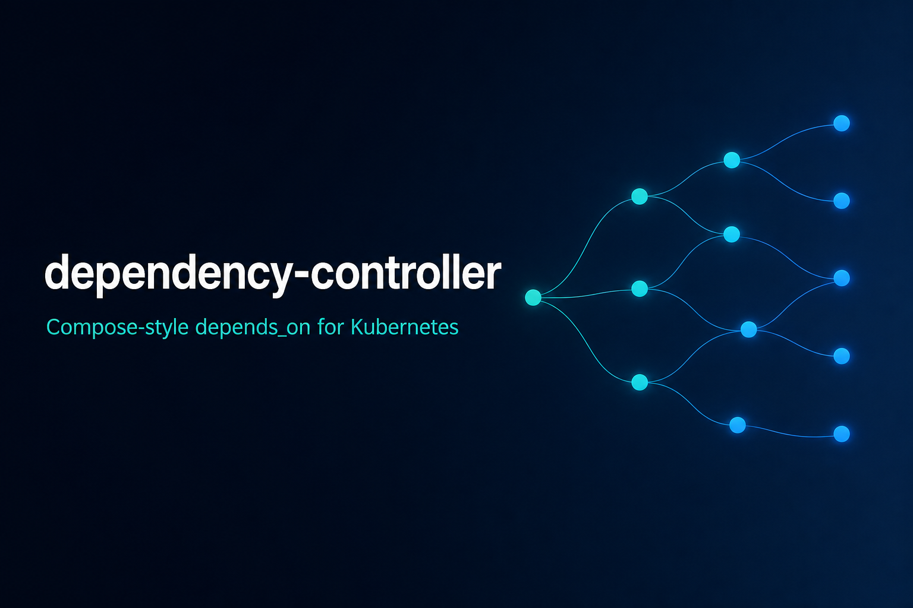

# dependency-controller

<p align="center">
  
</p>

[](https://github.com/nniksa91/dependency-controller/actions/workflows/ci.yml)
[](https://goreportcard.com/report/github.com/nniksa91/dependency-controller)
[](LICENSE)
[](go.mod)

Kubernetes operator that brings Docker Compose–style `depends_on` into the cluster: a **scale gate** so dependents do not need static probe delays or CrashLoop while waiting on dependencies.

Typed `ObjectRef` edges (`apiVersion` / `kind` / `name`) evaluate a Compose condition on the dependency, then scale scalable dependents to `0` until that condition is met and restore prior replicas afterward.

## Features

- **Typed refs** — `apiVersion` + `kind` + `name` for both sides of the edge (same namespace as the `Dependency` CR)
- **Compose conditions** — `serviceStarted`, `serviceHealthy`, `serviceCompleted`
- **Custom resources** — Ready condition or `readyWhen` JSONPath on the dependency
- **Safe scale gate** — `Deployment` / `StatefulSet` / `ReplicaSet` dependents scale to `0` and restore prior replicas
- **Observable status** — `dependencyReady`, `dependentScaledDown`, `reason`, `message`, and more
- **Dynamic watches** — built-in kinds plus GVKs referenced by live CRs

## Support matrix

| Role | Supported kinds | Behavior |
|------|-----------------|----------|
| **Dependency** (readiness source) | Built-ins: `Deployment`, `StatefulSet`, `ReplicaSet`, `Pod`, `Job`; plus custom resources (with RBAC) | Evaluated with `condition` / optional `readyWhen` |
| **Dependent** (gated object) | **Scalable:** `Deployment`, `StatefulSet`, `ReplicaSet` | Scaled to `0` when not ready; replicas restored when ready |
| **Dependent** (non-scalable) | `Pod`, `Job`, most custom resources | Not mutated; status `reason=DependentNotScalable` |

This is **not** a generic “gate any Kubernetes resource” controller. Cross-namespace refs are not supported (`ObjectRef` has no namespace field).

## Quick example

```yaml
apiVersion: core.example.com/v1
kind: Dependency
metadata:
  name: app-waits-for-db
  namespace: default
spec:
  condition: serviceHealthy
  dependency:
    apiVersion: apps/v1
    kind: StatefulSet
    name: db
  dependent:
    apiVersion: apps/v1
    kind: Deployment
    name: app
```

> **API group:** `core.example.com` is this project’s CRD API group (Kubebuilder default). It is not related to the public `example.com` website.

When `db` has no ready/available replicas, `app` is scaled to `0`. When it recovers, `app` is restored.

More examples: [`config/samples/`](config/samples/) · API details: [`docs/crd-reference.md`](docs/crd-reference.md)

## Demo scenarios

| Scenario | Purpose | Test script |
|----------|---------|-------------|
| [`config/samples/scenario-postgres-app/`](config/samples/scenario-postgres-app/) | Real Postgres + app with **no** app probes; controller keeps the app at 0 until the DB is Available | [`hack/test-postgres-app-dependency.sh`](hack/test-postgres-app-dependency.sh) |
| [`config/samples/scenario-app-waits-for-db/`](config/samples/scenario-app-waits-for-db/) | Synthetic slow DB (nginx + init sleep) for a short replica timeline | [`hack/test-slow-db.sh`](hack/test-slow-db.sh) |

(`hack/test-postgres-app-probes.sh` is a compatibility wrapper that calls `test-postgres-app-dependency.sh`.)

## Documentation

| Doc | Description |
|-----|-------------|
| [Architecture](docs/architecture.md) | Reconcile loop, watches, ready/gate packages |
| [CRD reference](docs/crd-reference.md) | Spec, status, conditions, samples |
| [Security](docs/security.md) | Secure install, PSA, RBAC, optional NetworkPolicy / admission / cosign |
| [Helm-style manifests](.helm/README.md) | Flat YAML install without Kustomize |
| [Contributing](CONTRIBUTING.md) | Dev setup and PR expectations |
| [Changelog](CHANGELOG.md) | Notable changes |

## Install

### Prerequisites

- Go 1.22+
- Docker (or compatible)
- `kubectl` and a Kubernetes 1.30+ cluster
- `make`

### Deploy with Kustomize

```sh
make docker-build docker-push IMG=<registry>/dependency-controller:<tag>
make deploy IMG=<registry>/dependency-controller:<tag>
```

### Local development

```sh
make install   # CRDs
make run       # manager against your kubeconfig
```

### Try the sample

```sh
kubectl apply -f .helm/test/pod1-deployment.yaml
kubectl apply -f .helm/test/pod2-deployment.yaml
kubectl apply -f config/samples/core_v1_dependency.yaml
kubectl get dependency -o wide
```

### Uninstall

```sh
kubectl delete -f config/samples/core_v1_dependency.yaml --ignore-not-found
make undeploy
make uninstall
```

## How it works (short)

```
Dependency CR  →  evaluate condition on dependency object
               →  scale / restore scalable dependent
               →  update status
```

Custom dependency kinds need extra RBAC (`get`/`list`/`watch` on that API group; add `update`/`patch` only if that kind is also a scalable dependent). Use the placeholder template [`config/rbac/custom_dependency_reader_role.yaml`](config/rbac/custom_dependency_reader_role.yaml) — never grant wildcards. Built-ins are covered by the generated ClusterRole — see [docs/security.md](docs/security.md).

## Development

```sh
make test              # unit tests
make lint              # golangci-lint
make manifests generate
make build
```

See [CONTRIBUTING.md](CONTRIBUTING.md) for the full workflow.

## Project layout

```
api/v1/                 CRD Go types
cmd/                    Manager entrypoint
internal/controller/    Reconciler + watches
internal/ready/         Compose condition evaluation
internal/gate/          Scale-to-zero / restore
config/                 Kustomize install (CRD, RBAC, manager)
config/network-policy/  Optional NetworkPolicy
config/policy/          Optional VAP / Kyverno (off by default)
config/samples/         Example Dependency CRs and demo scenarios
.helm/                  Flat YAML + demo Deployments
docs/                   Architecture and API docs
hack/                   Live cluster scenario scripts
```

## Compatibility

| Component | Version |
|-----------|---------|
| Go | 1.22+ |
| Kubernetes | 1.30+ (envtest / CI target) |
| controller-runtime | v0.18.x |

## License

[MIT](LICENSE) © Nikola Niksa

## Security

Private vulnerability reporting: [SECURITY.md](SECURITY.md). Operator hardening (PSA restricted, least-privilege RBAC, optional NetworkPolicy / ValidatingAdmissionPolicy / Kyverno+cosign examples): [docs/security.md](docs/security.md) · [`config/policy/`](config/policy/).
