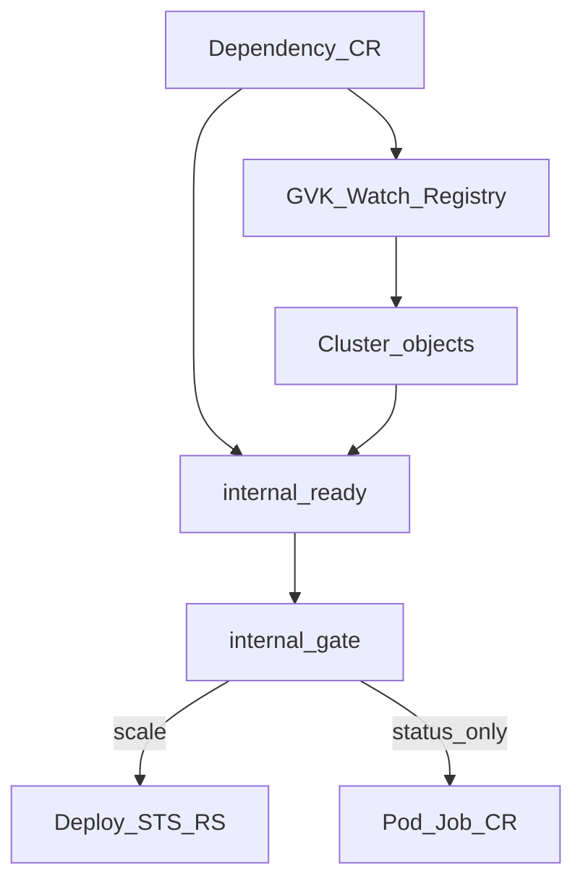

# Architecture — multi-kind Compose-style depends_on

## Goal

Mirror Docker Compose `depends_on` in Kubernetes: gate a **dependent** object until a **dependency** object satisfies a named condition. Both sides are typed (`apiVersion` / `kind` / `name`) and resolved in the **same namespace** as the `Dependency` CR.

The product thesis is a **scale gate**: keep scalable dependents at replicas `0` until the dependency is ready, so apps do not need guessed `initialDelaySeconds` / failure thresholds — and do not CrashLoop while waiting for a database or similar dependency.

Gating mutates only scalable dependents (`Deployment` / `StatefulSet` / `ReplicaSet`). Other dependent kinds are observed only (`DependentNotScalable`).

## Components



| Package | Role |
|---------|------|
| [`api/v1`](../api/v1) | `ObjectRef`, `condition`, `readyWhen`, status |
| [`internal/ready`](../internal/ready) | Compose condition evaluation on unstructured objects |
| [`internal/gate`](../internal/gate) | Scale-to-zero / restore for scalable kinds |
| [`internal/controller`](../internal/controller) | Reconcile, watches, status |

## Reconcile flow

1. Load `Dependency` CR (primary watch).
2. `ensureWatch` for dependency/dependent GVKs (built-ins pre-registered; CRs added on demand).
3. `Get` both refs as `unstructured.Unstructured` in the CR namespace.
4. `ready.Evaluate(dependency, condition, readyWhen)`.
5. If not ready → `gate.ScaleDown(dependent)`; if ready → `gate.ScaleUp(...)`.
6. Patch status (`dependencyReady`, `dependentScaledDown`, `condition`, `reason`, `message`, `observedGeneration`).
7. Requeue after 10s if either object is missing.

## Watches

- **Primary:** `Dependency`
- **Built-in secondary:** `Deployment`, `StatefulSet`, `ReplicaSet`, `Pod`, `Job`
- **Dynamic:** any other GVK referenced by a live CR (via `controller.Watch` + unstructured informer)

Events map back to Dependency CRs by matching `spec.dependency` / `spec.dependent` name + GVK in the same namespace.

## Readiness ([`internal/ready`](../internal/ready))

| Condition | Built-ins | Custom resources |
|-----------|-----------|------------------|
| `serviceStarted` | Exists, not terminating | Exists |
| `serviceHealthy` | Available/ready replicas; Pod Ready | `status.conditions[Ready=True]`, else `readyWhen` JSONPath, else exists |
| `serviceCompleted` | Job Complete; Pod Succeeded | Falls through to healthy/Ready logic |

## Gating ([`internal/gate`](../internal/gate))

**Scalable:** `Deployment`, `StatefulSet`, `ReplicaSet`

- Scale-down: annotate `dependency-controller/original-replicas`, set `spec.replicas=0`
- Scale-up: `spec.desiredReplicas` → annotation → `1`

**Non-scalable:** no mutation; status `DependentNotScalable`.

## RBAC

Generated `manager-role` ClusterRole covers pods, apps workloads, jobs, and the Dependency CRD (least privilege for built-ins — no wildcards). Editor/viewer ClusterRoles are for humans only and are not bound to the controller SA.

For custom dependency kinds, start from [`config/rbac/custom_dependency_reader_role.yaml`](../config/rbac/custom_dependency_reader_role.yaml). Readiness-only dependencies:

```yaml
- apiGroups: ["db.example.com"]  # placeholder API group for your CRD
  resources: ["databases"]
  verbs: ["get", "list", "watch"]
```

If the custom kind is a **scalable dependent**, also grant `update`/`patch`. Avoid wildcards. See [security.md](security.md).

## Limitations

- Same-namespace only
- Non-scalable dependents are observed, not blocked at admission
- HPA may fight replica updates on scalable dependents
- No multi-dependency list in one CR (use multiple CRs)
